# 💬 Student Support Chat - Fullstack Monorepo

[](https://nx.dev/)
[](https://react.dev/)
[](https://github.com/css-modules/css-modules)
[](https://www.oracle.com/java/)
[](https://spring.io/projects/spring-boot)
[](https://spring.io/guides/gs/messaging-stomp-websocket/)
[](https://www.mysql.com/)
[](LICENSE)

Plataforma fullstack de atención, asesoría y soporte estudiantil en tiempo real organizada bajo una arquitectura **Monorepo gestionada con Nx**. Combina un cliente frontend en **React (Vite + TypeScript + CSS Modules)** con estándares estrictos de Clean Code y desacoplamiento, y un backend en **Spring Boot 3 + Java 21** con APIs RESTful y mensajería bidireccional vía **WebSockets (STOMP)**.

---

## 🏛️ Arquitectura Monorepo (Nx Workspace)

El repositorio se estructura en un único espacio de trabajo multi-proyecto:

```text
chat-asistencia-estudiante/
├── apps/
│   ├── client/                  # Frontend: SPA React (Vite + CSS Modules + STOMP) -> Deploy en Vercel
│   └── server/                  # Backend: Spring Boot 3 + Java 21 REST API & WebSocket Broker
├── nx.json                      # Configuración de orquestación y cache de Nx
└── package.json                 # Gestión de dependencias y scripts globales
```

### Flujo de Comunicación del Sistema

```mermaid
flowchart TD
    subgraph NxMonorepo["Espacio de Trabajo Monorepo (Nx)"]
        subgraph ClientApp["apps/client (React + Vite + CSS Modules)"]
            UI[UI / Dashboard Estudiantes y Asesores]
            WSClient[STOMP WebSocket Client]
        end

        subgraph ServerApp["apps/server (Spring Boot 3 + Java 21)"]
            CORS[CORS Filter] --> REST[REST Controllers]
            REST --> Service[Service Layer]
            
            WS[Endpoint /ws-chat] --> Broker[Simple In-Memory Broker]
            Broker --> PubSub["Pub/Sub: /topic/chat/{id}"]

            Service --> Repos[Spring Data JPA Repositories]
        end
    end

    subgraph DataStore["Capa de Persistencia"]
        MySQL[(MySQL 8 Database)]
    end

    subgraph CloudHosting["Despliegue en la Nube"]
        VercelCloud[Vercel: Frontend Host]
        BackendCloud[Cloud PaaS: Backend Host]
    end

    UI -- "HTTP REST (JSON)" --> CORS
    WSClient <== "WSS Bidireccional" ==> WS
    Repos <--> MySQL

    ClientApp -.-> VercelCloud
    ServerApp -.-> BackendCloud
```



---

## 🎨 Arquitectura y Estándares del Frontend (`apps/client`)

El frontend está diseñado sin librerías de estilos externas, priorizando modularidad, mantenibilidad y cobertura de pruebas unitarias:

### 1. Estilos Nativos con CSS Modules
- Cero frameworks o librerías CSS de terceros (sin Tailwind, Bootstrap, ni UI libraries).
- Cada componente cuenta con su archivo de estilos encapsulado: `[Componente].module.css`.

### 2. Estructura de Componentes y Desacoplamiento
```text
components/
└── [ComponentName]/
    ├── [ComponentName].tsx              # Renderizado y ciclo de vida visual
    ├── [ComponentName].module.css       # Estilos exclusivos del componente
    ├── hooks/                           # (Opcional: cuando existe más de un custom hook)
    │   └── use[Feature].ts              # Solo orquesta y llama funciones de utils/
    └── utils/                           # Lógica de negocio pura
        ├── [featureUtils].ts            # Funciones puras (sin estado de React)
        └── [featureUtils].test.ts       # Tests unitarios colocalizados como hermanos
```

### 3. Reglas de Negocio en Hooks y Utils
- **Hooks limpios:** Los custom hooks no definen lógica de cálculo ni funciones de transformación complejas internamente; su único rol es orquestar estado y ejecutar las funciones puras declaradas en `utils/`.
- **Pure Functions & TDD:** Toda la lógica pesada o manipulaciones residen en `utils/` en funciones puras y deterministas.
- **Colocalización de Tests:** En la carpeta `utils/`, cada archivo `[name].ts` tiene a su lado su archivo hermano de pruebas `[name].test.ts`.

---

## 🚀 Características Principales

- **Mensajería en Tiempo Real:** Comunicación instantánea sin recargas mediante WebSockets y protocolo STOMP (`/topic/chat/{codChat}`).
- **Gestión de Tickets y Consultas:** Clasificación por niveles de prioridad (Alta, Media, Baja) y categorías académicas.
- **Segmentación por Roles:**
  - **Estudiante:** Apertura de solicitudes de soporte y seguimiento en tiempo real de sus dudas.
  - **Asesor / Soporte:** Panel de control con bandeja de entrada filtrable por prioridad para atención de tickets.
- **Monorepo Optimizado con Nx:** Comandos unificados para desarrollo, pruebas y construcción de frontend y backend.
- **CORS Habilitado:** Comunicación fluida entre el frontend en Vercel y el backend en la nube.

---

## 🛠️ Stack Tecnológico

### Frontend (`apps/client`)
- **Core:** React (Vite + TypeScript)
- **Estilos:** Pure CSS Modules (`*.module.css`) nativo
- **Testing:** Vitest / Jest para funciones en `utils/`
- **Conectividad:** Axios / Fetch API & `@stomp/stompjs` + `sockjs-client`
- **Hosting:** Vercel (CI/CD automático en cada commit)

### Backend (`apps/server`)
- **Lenguaje:** Java 21 LTS
- **Framework:** Spring Boot 3.x
  - `spring-boot-starter-web` (APIs RESTful)
  - `spring-boot-starter-data-jpa` (Persistencia ORM con Hibernate)
  - `spring-boot-starter-websocket` (Mensajería STOMP en tiempo real)
- **Base de Datos:** MySQL 8.0+ / Conector Oficial `mysql-connector-j`
- **Gestión de Entorno:** SDKMAN & Apache Maven

---

## 📡 Endpoints de la API REST

### 🔐 Autenticación
| Método | Endpoint | Descripción | Body (JSON) |
| :--- | :--- | :--- | :--- |
| `POST` | `/api/auth/login` | Inicia sesión del usuario | `{ "correo": "...", "password": "..." }` |
| `GET` | `/api/auth/logout` | Cierra la sesión activa | N/A |

### 💬 Chats / Tickets
| Método | Endpoint | Descripción | Parámetros Query |
| :--- | :--- | :--- | :--- |
| `GET` | `/api/chats` | Lista los chats según rol (asesor/estudiante) | `?priority={id}` (opcional) |
| `POST` | `/api/chats` | Crea una nueva sala de chat / ticket | Objeto `ChatEntity` |

### ✉️ Mensajes
| Método | Endpoint | Descripción | Body (JSON) |
| :--- | :--- | :--- | :--- |
| `GET` | `/api/chats/{codChat}/mensajes` | Historial de mensajes de un chat | N/A |
| `POST` | `/api/chats/{codChat}/mensajes` | Registra y emite el mensaje vía WebSocket | `{ "contenido": "..." }` |

### 🏷️ Prioridades
| Método | Endpoint | Descripción |
| :--- | :--- | :--- |
| `GET` | `/api/prioridades` | Lista los niveles de prioridad |

---

## 🔌 Canales de WebSocket (STOMP)

- **Handshake:** `ws://localhost:8080/ws-chat` (compatible con fallback SockJS)
- **Canal de Suscripción (Topic):** `/topic/chat/{codChat}`  
  *(Los clientes suscritos reciben los mensajes en tiempo real cuando alguien envía una respuesta).*

---

## 💻 Puesta en Marcha Local

### 1. Prerrequisitos
- **Node.js** (v20+ recomendado) y gestor de paquetes (`npm` o `pnpm`).
- **Java 21 LTS** (recomendado gestionar con [SDKMAN](https://sdkman.io/)):
  ```bash
  sdk install java 21.0.6-tem
  sdk use java 21.0.6-tem
  ```
- **Docker** o **MySQL 8** en ejecución.

### 2. Base de Datos Rápida (Docker)
```bash
docker run -d --name mysql-chat \
  -p 3306:3306 \
  -e MYSQL_DATABASE=proyecto_efst \
  -e MYSQL_ROOT_PASSWORD=mysql \
  mysql:8.0
```

### 3. Ejecución del Backend
```bash
chmod +x mvnw
./mvnw spring-boot:run
```

---

## 🗺️ Roadmap de Evolución

- [x] Migración de arquitectura Monolito a REST API.
- [x] Integración de mensajería en tiempo real con WebSockets (STOMP).
- [ ] Configuración de espacio de trabajo **Monorepo con Nx**.
- [ ] Creación de aplicación **React en `apps/client`** (Vite + CSS Modules nativo + STOMP client + Vitest).
- [ ] Actualización completa de dependencias de Backend a **Spring Boot 3.3.x + Jakarta EE**.
- [ ] Implementación de **Spring Security 6 con JWT** para autenticación segura sin sesiones de estado.
- [ ] Documentación interactiva con **OpenAPI / Swagger UI** (`springdoc-openapi`).
- [ ] Despliegue de Frontend en **Vercel** y Backend en la nube con pipeline CI/CD en **GitHub Actions**.
