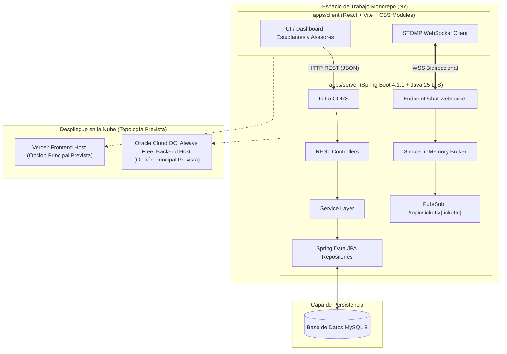

# 💬 Student Support Chat - Monorepo Fullstack

[](https://nx.dev/)
[](https://react.dev/)
[](https://github.com/css-modules/css-modules)
[](https://www.oracle.com/java/)
[](https://spring.io/projects/spring-boot)
[](https://spring.io/guides/gs/messaging-stomp-websocket/)
[](https://www.mysql.com/)
[](LICENSE)

Plataforma fullstack de atención, asesoría y soporte estudiantil en tiempo real organizada bajo una arquitectura **Monorepo gestionada con Nx**. Integra un cliente frontend en **React (Vite + TypeScript + CSS Modules nativo)** bajo estándares estrictos de Clean Code y desacoplamiento, y un backend en **Spring Boot 4.1.1 + Java 25 LTS** con APIs RESTful y mensajería bidireccional vía **WebSockets (STOMP)**.

---

## 🏛️ Arquitectura Monorepo (Nx Workspace)

El repositorio se estructura en un único espacio de trabajo multi-proyecto:

```text
chat-asistencia-estudiante/
├── apps/
│   ├── client/                  # Frontend: SPA React (Vite + CSS Modules + STOMP) -> Deploy en Vercel
│   └── server/                  # Backend: Spring Boot 4.1.1 + Java 25 LTS REST API & WebSocket Broker
├── nx.json                      # Configuración de orquestación y cache de Nx
├── package.json                 # Gestión de dependencias y scripts globales
└── pnpm-workspace.yaml          # Configuración de workspaces de pnpm
```

### Flujo de Comunicación del Sistema


```mermaid
flowchart TD
    subgraph NxMonorepo["Espacio de Trabajo Monorepo (Nx)"]
        subgraph ClientApp["apps/client (React + Vite + CSS Modules)"]
            UI[UI / Dashboard Estudiantes y Asesores]
            WSClient[STOMP WebSocket Client]
        end

        subgraph ServerApp["apps/server (Spring Boot 4.1.1 + Java 25 LTS)"]
            CORS[Filtro CORS] --> REST[REST Controllers]
            REST --> Service[Service Layer]
            
            WS[Endpoint /chat-websocket] --> Broker[Simple In-Memory Broker]
            Broker --> PubSub["Pub/Sub: /topic/tickets/{ticketId}"]

            Service --> Repos[Spring Data JPA Repositories]
        end
    end

    subgraph DataStore["Capa de Persistencia"]
        MySQL[(Base de Datos MySQL 8)]
    end

    subgraph CloudHosting["Despliegue en la Nube (Topología Prevista)"]
        VercelCloud["Vercel: Frontend Host (Opción Principal Prevista)"]
        BackendCloud["Oracle Cloud OCI Always Free: Backend Host (Opción Principal Prevista)"]
    end

    UI -- "HTTP REST (JSON)" --> CORS
    WSClient <== "WSS Bidireccional" ==> WS
    Repos <--> MySQL

    ClientApp -.-> VercelCloud
    ServerApp -.-> BackendCloud
```

---

## 🎨 Arquitectura y Estándares del Frontend (`apps/client`)

El frontend está diseñado sin librerías de estilos externas, priorizando modularidad, mantenibilidad y cobertura de pruebas unitarias:

### 1. Estilos Nativos con CSS Modules
- Cero dependencias de diseño de terceros (sin Tailwind, Bootstrap, ni UI libraries externas).
- Cada componente cuenta con su archivo de estilos encapsulado: `[Componente].module.css`.

### 2. Estructura de Componentes y Desacoplamiento
```text
components/
└── [ComponentName]/
    ├── [ComponentName].tsx              # Renderizado y ciclo de vida visual
    ├── [ComponentName].module.css       # Estilos exclusivos del componente
    ├── hooks/                           # (Opcional: cuando existe más de un custom hook)
    │   └── use[Feature].ts              # Solo orquesta y consume funciones de utils/
    └── utils/                           # Lógica pura de negocio
        ├── [featureUtils].ts            # Funciones puras (sin dependencias ni estado de React)
        └── [featureUtils].test.ts       # Tests unitarios colocalizados como hermanos
```

### 3. Reglas de Negocio en Hooks y Utils
- **Hooks limpios:** Los custom hooks no definen algoritmos complejos internamente; su único rol es coordinar estado y ejecutar las funciones puras declaradas en `utils/`.
- **Pure Functions & TDD:** Toda la lógica pesada o manipulaciones residen en `utils/` en funciones deterministas fáciles de testear.
- **Colocalización de Tests:** En la carpeta `utils/`, cada archivo `[name].ts` tiene a su lado su archivo hermano de pruebas `[name].test.ts`.

---

## 🚀 Características Principales

- **Mensajería en Tiempo Real:** Comunicación instantánea sin recargas mediante WebSockets y protocolo STOMP (`/topic/tickets/{ticketId}`).
- **Gestión de Tickets y Consultas:** Clasificación por niveles de prioridad (Alta, Media, Baja), categorías académicas y ciclo de vida de estados (`OPEN`, `ASSIGNED`, `IN_PROGRESS`, `WAITING_STUDENT`, `RESOLVED`, `CLOSED`).
- **Segmentación por Roles:**
  - **Estudiante:** Apertura de solicitudes de soporte y seguimiento en tiempo real de sus dudas.
  - **Asesor / Soporte:** Panel de control con bandeja de entrada filtrable por prioridad y estado para atención de tickets.
  - **Administrador:** Supervisión global y actualización irrestricta de tickets.
- **Monorepo Optimizado con Nx:** Comandos unificados para desarrollo, pruebas y construcción de frontend y backend.
- **Concurrencia de Alto Rendimiento:** Habilitación de Virtual Threads de Java 25 LTS para optimizar el I/O en Spring Boot.

---

## 🛠️ Stack Tecnológico

### Frontend (`apps/client`)
- **Core:** React (Vite + TypeScript)
- **Estilos:** Pure CSS Modules (`*.module.css`) nativo
- **Testing:** Vitest / React Testing Library
- **Conectividad:** Axios / Fetch API & `@stomp/stompjs` + `sockjs-client`
- **Tipado API:** `openapi-typescript` (generación automática de contratos vía `pnpm codegen:api`)
- **Hosting:** Vercel (CI/CD automático)

### Backend (`apps/server`)
- **Lenguaje:** Java 25 LTS (Virtual Threads habilitados)
- **Framework:** Spring Boot 4.1.1
  - `spring-boot-starter-web` (APIs RESTful)
  - `spring-boot-starter-data-jpa` (Persistencia ORM Jakarta EE)
  - `spring-boot-starter-websocket` (Mensajería STOMP en tiempo real)
  - `springdoc-openapi-starter-webmvc-ui` (Documentación OpenAPI 3 / Swagger UI)
- **Base de Datos:** MySQL 8.0+ / Driver oficial `mysql-connector-j`
- **Build & Monorepo:** Gradle 9.8.0, SDKMAN & Nx

---

## 📡 Endpoints de la API REST

### 🔐 Autenticación
| Método | Endpoint | Descripción | Body (JSON) |
| :--- | :--- | :--- | :--- |
| `POST` | `/api/auth/login` | Inicia sesión del usuario | `{ "email": "...", "password": "..." }` |
| `GET` | `/api/auth/logout` | Cierra la sesión activa | N/A |

### 💬 Tickets
| Método | Endpoint | Descripción | Parámetros Query / Body |
| :--- | :--- | :--- | :--- |
| `GET` | `/api/tickets` | Lista tickets según rol (asesor: asignados y libres; estudiante: propios; admin: todos) | `?status={OPEN\|ASSIGNED\|IN_PROGRESS\|WAITING_STUDENT\|RESOLVED\|CLOSED}`<br>`?priority={LOW\|MEDIUM\|HIGH}` |
| `POST` | `/api/tickets` | Crea un nuevo ticket de soporte (solo estudiantes) | `{ "title": "...", "description": "...", "category": "GENERAL\|TECHNICAL\|BILLING\|FEEDBACK" }` |
| `PATCH` | `/api/tickets/{ticketId}/status` | Actualiza estado del ticket (asesores/admin) y emite evento STOMP | `{ "status": "RESOLVED", "resolutionSummary": "...", "resolutionCategory": "SYSTEM_FIX" }` |

### ✉️ Mensajes
| Método | Endpoint | Descripción | Parámetros Query / Body |
| :--- | :--- | :--- | :--- |
| `GET` | `/api/tickets/{ticketId}/messages` | Historial paginado con cursor para scroll infinito | `?before={ISO-8601}` (opcional)<br>`?limit={1-100}` (por defecto 30) |
| `POST` | `/api/tickets/{ticketId}/messages` | Registra y emite el mensaje vía WebSocket | `{ "content": "..." }` |

---

## 🔌 Canales de WebSocket (STOMP)

- **Handshake Endpoint:** `ws://localhost:8080/chat-websocket`
- **Canal de Mensajería del Ticket:** `/topic/tickets/{ticketId}`  
  *(Los clientes suscritos reciben las publicaciones de nuevos mensajes en tiempo real).*
- **Canal de Estado del Ticket:** `/topic/tickets/{ticketId}/status`  
  *(Los clientes suscritos reciben eventos en tiempo real ante transiciones de estado del ticket).*

---

## 💻 Puesta en Marcha Local

### 1. Prerrequisitos
- **Node.js** (v20+) y **pnpm** (v10+).
- **Java 25 LTS** (recomendado gestionar con [SDKMAN](https://sdkman.io/)):
  ```bash
  sdk env
  # O instalación directa:
  # sdk install java 25-amzn
  ```
- **Docker** o **MySQL 8** en ejecución.

### 2. Variables de Entorno (Backend y Frontend)
Copia las plantillas de variables de entorno y ajusta tus credenciales locales:

```bash
# Backend (Spring Boot / MySQL / JWT)
cp apps/server/.env.example apps/server/.env

# Frontend (API URL / WebSocket Endpoint)
cp apps/client/.env.example apps/client/.env
```

### 3. Base de Datos en Contenedor (Docker)
```bash
docker run -d --name mysql-chat \
  -p 3306:3306 \
  -e MYSQL_DATABASE=proyecto_dswii \
  -e MYSQL_ROOT_PASSWORD=mysql \
  mysql:8.0
```

### 4. Ejecución del Entorno de Desarrollo

- **Iniciar Todo el Monorepo (Frontend + Backend):**
  ```bash
  pnpm dev
  ```
  *Inicia simultáneamente las aplicaciones gestionadas por Nx en paralelo.*

- **O Ejecutar por Componentes Separados:**
  ```bash
  # Backend (Spring Boot)
  pnpm dev:server
  # O directamente: cd apps/server && ./gradlew bootRun

  # Frontend (React + Vite)
  pnpm dev:client
  ```

### 5. Generación Offline de Tipos TypeScript (OpenAPI Codegen)
Sincroniza los contratos tipados para el frontend en `apps/client/src/api/generated/api-schema.ts`:
```bash
pnpm codegen:api
```
*Operación 100% offline y determinista:*
- Lee el esquema exportado por Gradle en `apps/server/build/openapi.json`.
- Si el archivo aún no existe en el entorno local, ejecuta automáticamente `./gradlew test --tests OpenApiContractTest` para exportarlo en ~1.5s sin requerir un servidor HTTP en ejecución.

### 6. Inspección y Tareas Globales del Monorepo con Nx

- **Compilar todos los proyectos:**
  ```bash
  pnpm build
  ```

- **Ejecutar todas las pruebas:**
  ```bash
  pnpm test
  ```

- **Visualizar el Grafo de Dependencias (Servidor Web Interactivo):**
  ```bash
  pnpm nx graph
  ```
  *Abre una interfaz gráfica interactiva en `http://127.0.0.1:4211` para explorar la arquitectura y dependencias entre aplicaciones y librerías.*

  Para resaltar visualmente solo los proyectos afectados por cambios locales:
  ```bash
  pnpm nx graph --affected --base=origin/main
  ```

- **Listar Proyectos Afectados en Terminal:**
  ```bash
  pnpm nx show projects --affected --base=origin/main
  ```

- **Ejecutar Tests y Build de Proyectos Afectados (con Cache):**
  ```bash
  pnpm nx affected -t test build --base=origin/main
  ```

---

## 🗺️ Roadmap de Evolución

- [x] Migración de arquitectura Monolito a REST API.
- [x] Integración de mensajería en tiempo real con WebSockets (STOMP).
- [x] Configuración de espacio de trabajo **Monorepo con Nx**.
- [x] Actualización de dependencias a **Spring Boot 4.1.1 + Jakarta EE + Java 25 LTS**.
- [x] Migración del sistema de construcción backend a **Gradle 9.8.0**.
- [x] Refactorización completa de base de datos y backend al inglés.
- [x] Documentación interactiva con **OpenAPI / Swagger UI** (`springdoc-openapi`) y script de sincronización offline de contratos TypeScript (`pnpm codegen:api`).
- [ ] Creación de aplicación **React en `apps/client`** (Vite + CSS Modules nativo + STOMP client + Vitest).
- [ ] Implementación de **Spring Security 6 con JWT** para autenticación segura sin estado.
- [ ] Despliegue en la nube previsto: Frontend en **Vercel** y Backend en **Oracle Cloud (OCI Always Free)** con pipeline CI/CD en **GitHub Actions**.
